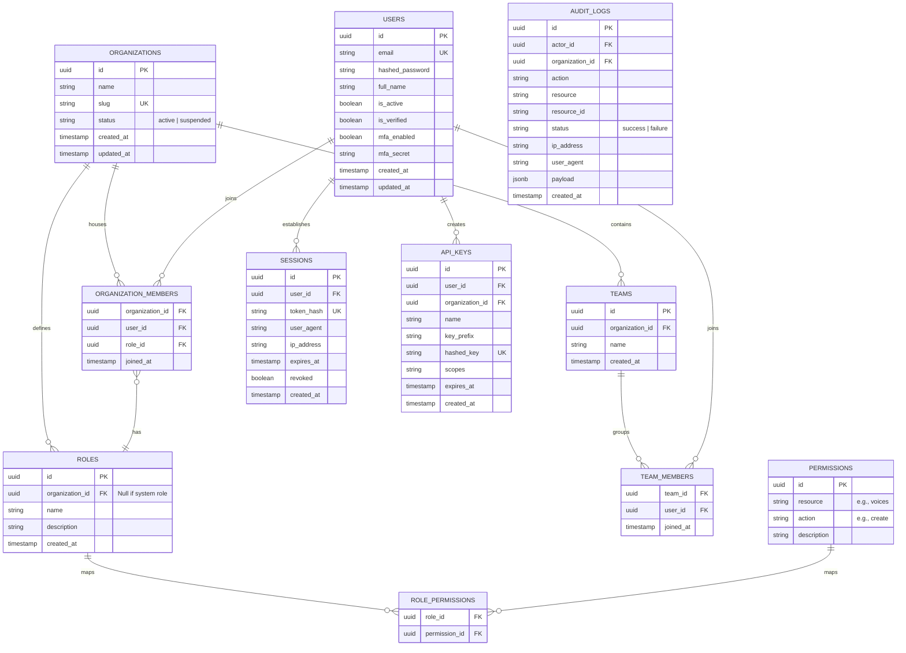

# ShivaAI (Svara AI) Authentication & Authorization Specification
**Module 3**  

---

## 1. Authentication Architecture

ShivaAI leverages a hybrid security system designed for both human users (web dashboard interface) and machine agents (developer API clients).

```
  [Web Client]                  [Developer API Client]
       |                                  |
       | HTTPS (Secure HTTPOnly Cookie)   | HTTPS (X-API-KEY Header)
       v                                  v
+-------------------------------------------------------------+
|                     Nginx Edge Proxy                        |
+-------------------------------------------------------------+
                               |
                               v (Internal Proxy Pass)
+-------------------------------------------------------------+
|                       FastAPI Gateway                       |
|                                                             |
|   +-------------------+              +------------------+   |
|   |   JWT Authenticator|              | API Key Validator|   |
|   +-------------------+              +------------------+   |
|             |                                 |             |
+-------------|---------------------------------|-------------+
              |                                 |
              +--------------+   +--------------+
                             v   v
                      [Local Security Context]
                             |
                             +---> [Role/Permission Evaluator]
                                         |
                                         +---> Allow / Deny Request
```

### Token Lifecycle & Expiration Strategy
We implement a **Dual-Token System** (Access Token + Refresh Token) with **Refresh Token Rotation (RTR)** to prevent replay attacks.

1. **Access Token (JWT)**:
   - **Lifespan**: 15 minutes.
   - **Signature**: Signed using **RS256** (RSA Signature with SHA-256) public/private key cryptography.
   - **Storage (Web)**: In-memory JavaScript variable (not persisted in LocalStorage/SessionStorage to prevent XSS).
   - **Storage (API/Mobile)**: Memory or OS-level secure storage keychain.
2. **Refresh Token**:
   - **Lifespan**: 7 days (sliding window).
   - **Signature**: High-entropy cryptographically secure random string (64 characters).
   - **Database Storage**: Hashed using **SHA-256** inside the persistent storage.
   - **Storage (Web)**: Sent to client as an `HttpOnly`, `Secure`, `SameSite=Strict` cookie, bound to the path `/api/v1/auth/refresh`.

### Refresh Token Rotation (RTR) & Replay Prevention
To mitigate the risk of stolen refresh tokens:
* When a client calls `/api/v1/auth/refresh`, the server invalidates the used refresh token and returns a **new access token + new refresh token** pair.
* If a previously used refresh token is presented, the system flags it as a **Replay Attack**. The authorization engine immediately **invalidates all active sessions** for that user, forcing a complete re-authentication.

### Session Management & Revocation
Active sessions are mirrored in a Redis cache. This allows instant global session revocation (e.g., on password reset or "Logout from all devices"):
* Key format in Redis: `session:<user_id>:<session_uuid>`
* Value: Metadata mapping (User Agent, IP Address, Issue Date).
* On token verification, the gateway performs a quick `EXISTS` check in Redis to ensure the session is active.

---

## 2. Database Schema

The schema design utilizes standard relational structures in PostgreSQL to support multi-tenant billing partitions (Organizations), resource grouping (Teams), role assignment, and SOC2 compliant logging.



### Table Definitions & Constraints

```sql
-- Core Organizations
CREATE TABLE organizations (
    id UUID PRIMARY KEY DEFAULT gen_random_uuid(),
    name VARCHAR(255) NOT NULL,
    slug VARCHAR(255) UNIQUE NOT NULL,
    status VARCHAR(50) NOT NULL DEFAULT 'active' CHECK (status IN ('active', 'suspended')),
    created_at TIMESTAMP WITH TIME ZONE DEFAULT CURRENT_TIMESTAMP,
    updated_at TIMESTAMP WITH TIME ZONE DEFAULT CURRENT_TIMESTAMP
);
CREATE INDEX idx_orgs_slug ON organizations(slug);

-- Core Users
CREATE TABLE users (
    id UUID PRIMARY KEY DEFAULT gen_random_uuid(),
    email VARCHAR(255) UNIQUE NOT NULL,
    hashed_password VARCHAR(255) NOT NULL,
    full_name VARCHAR(255) NOT NULL,
    is_active BOOLEAN NOT NULL DEFAULT TRUE,
    is_verified BOOLEAN NOT NULL DEFAULT FALSE,
    mfa_enabled BOOLEAN NOT NULL DEFAULT FALSE,
    mfa_secret VARCHAR(128),
    created_at TIMESTAMP WITH TIME ZONE DEFAULT CURRENT_TIMESTAMP,
    updated_at TIMESTAMP WITH TIME ZONE DEFAULT CURRENT_TIMESTAMP
);
CREATE INDEX idx_users_email ON users(email);

-- Enterprise Roles
CREATE TABLE roles (
    id UUID PRIMARY KEY DEFAULT gen_random_uuid(),
    organization_id UUID REFERENCES organizations(id) ON DELETE CASCADE, -- Null means global default role
    name VARCHAR(100) NOT NULL,
    description TEXT,
    created_at TIMESTAMP WITH TIME ZONE DEFAULT CURRENT_TIMESTAMP,
    UNIQUE (organization_id, name)
);

-- Granular Resource Permissions
CREATE TABLE permissions (
    id UUID PRIMARY KEY DEFAULT gen_random_uuid(),
    resource VARCHAR(100) NOT NULL, -- e.g. 'voices', 'jobs', 'billing'
    action VARCHAR(100) NOT NULL,   -- e.g. 'create', 'read', 'update', 'delete', 'execute'
    description TEXT,
    UNIQUE (resource, action)
);

-- Junction: Role <-> Permission
CREATE TABLE role_permissions (
    role_id UUID REFERENCES roles(id) ON DELETE CASCADE,
    permission_id UUID REFERENCES permissions(id) ON DELETE CASCADE,
    PRIMARY KEY (role_id, permission_id)
);

-- Organization Membership & Tenant Assignment
CREATE TABLE organization_members (
    organization_id UUID REFERENCES organizations(id) ON DELETE CASCADE,
    user_id UUID REFERENCES users(id) ON DELETE CASCADE,
    role_id UUID REFERENCES roles(id) ON DELETE RESTRICT,
    joined_at TIMESTAMP WITH TIME ZONE DEFAULT CURRENT_TIMESTAMP,
    PRIMARY KEY (organization_id, user_id)
);

-- Teams partition under Organization
CREATE TABLE teams (
    id UUID PRIMARY KEY DEFAULT gen_random_uuid(),
    organization_id UUID NOT NULL REFERENCES organizations(id) ON DELETE CASCADE,
    name VARCHAR(255) NOT NULL,
    created_at TIMESTAMP WITH TIME ZONE DEFAULT CURRENT_TIMESTAMP
);

-- Team Membership
CREATE TABLE team_members (
    team_id UUID REFERENCES teams(id) ON DELETE CASCADE,
    user_id UUID REFERENCES users(id) ON DELETE CASCADE,
    joined_at TIMESTAMP WITH TIME ZONE DEFAULT CURRENT_TIMESTAMP,
    PRIMARY KEY (team_id, user_id)
);

-- Active User Web Sessions
CREATE TABLE sessions (
    id UUID PRIMARY KEY DEFAULT gen_random_uuid(),
    user_id UUID NOT NULL REFERENCES users(id) ON DELETE CASCADE,
    token_hash VARCHAR(64) UNIQUE NOT NULL,
    user_agent VARCHAR(512),
    ip_address VARCHAR(45),
    expires_at TIMESTAMP WITH TIME ZONE NOT NULL,
    revoked BOOLEAN NOT NULL DEFAULT FALSE,
    created_at TIMESTAMP WITH TIME ZONE DEFAULT CURRENT_TIMESTAMP
);
CREATE INDEX idx_sessions_token ON sessions(token_hash);

-- Machine API Keys
CREATE TABLE api_keys (
    id UUID PRIMARY KEY DEFAULT gen_random_uuid(),
    user_id UUID NOT NULL REFERENCES users(id) ON DELETE CASCADE,
    organization_id UUID NOT NULL REFERENCES organizations(id) ON DELETE CASCADE,
    name VARCHAR(255) NOT NULL,
    key_prefix VARCHAR(8) NOT NULL, -- e.g. 'sv_live_'
    hashed_key VARCHAR(64) UNIQUE NOT NULL, -- SHA-256 hash of full token
    scopes TEXT, -- JSON-formatted string arrays of permitted endpoints
    expires_at TIMESTAMP WITH TIME ZONE,
    created_at TIMESTAMP WITH TIME ZONE DEFAULT CURRENT_TIMESTAMP
);
CREATE INDEX idx_keys_hash ON api_keys(hashed_key);

-- Compliance Audit Log (SOC2 compliant)
CREATE TABLE audit_logs (
    id UUID PRIMARY KEY DEFAULT gen_random_uuid(),
    actor_id UUID REFERENCES users(id) ON DELETE SET NULL,
    organization_id UUID REFERENCES organizations(id) ON DELETE CASCADE,
    action VARCHAR(100) NOT NULL,    -- e.g. 'user.login', 'voice.delete'
    resource VARCHAR(100) NOT NULL,  -- e.g. 'voice'
    resource_id VARCHAR(100),
    status VARCHAR(50) NOT NULL,     -- 'success' | 'failure'
    ip_address VARCHAR(45),
    user_agent VARCHAR(512),
    payload JSONB,                   -- Strict metadata changes representation
    created_at TIMESTAMP WITH TIME ZONE DEFAULT CURRENT_TIMESTAMP
);
CREATE INDEX idx_audit_org_created ON audit_logs(organization_id, created_at DESC);
```

---

## 3. API Design

All endpoints follow RESTful standards and enforce JSON payloads.

### User Flow API Specifications

#### A. User Registration (`POST /api/v1/auth/signup`)
- **Request Payload**:
  ```json
  {
    "email": "user@enterprise.com",
    "password": "HighEntropyPassword123!",
    "full_name": "Devin Carter",
    "organization_name": "Carter AI Labs"
  }
  ```
- **Response Payload (HTTP 201 Created)**:
  ```json
  {
    "success": true,
    "data": {
      "user_id": "8c59f0f1-4db3-4318-971c-3bbfef1265bf",
      "email": "user@enterprise.com",
      "is_verified": false,
      "message": "Registration successful. Please verify your email via the link sent to your address."
    }
  }
  ```

#### B. User Verification Code (`GET /api/v1/auth/verify`)
- **Query Parameters**:
  - `token`: Cryptographically signed token containing verification metadata.
- **Response Payload (HTTP 200 OK)**:
  ```json
  {
    "success": true,
    "data": {
      "user_id": "8c59f0f1-4db3-4318-971c-3bbfef1265bf",
      "email": "user@enterprise.com",
      "is_verified": true
    }
  }
  ```

#### C. User Login (`POST /api/v1/auth/login`)
- **Request Payload**:
  ```json
  {
    "username": "user@enterprise.com",
    "password": "HighEntropyPassword123!"
  }
  ```
- **Response Payload (HTTP 200 OK)**:
  *Sets HttpOnly secure cookie containing `refresh_token`*.
  ```json
  {
    "success": true,
    "data": {
      "access_token": "eyJhbGciOiJSUzI1NiIsInR5cCI6IkpXVCJ9...",
      "token_type": "bearer",
      "expires_in": 900,
      "user": {
        "id": "8c59f0f1-4db3-4318-971c-3bbfef1265bf",
        "email": "user@enterprise.com",
        "full_name": "Devin Carter"
      }
    }
  }
  ```

#### D. Token Refresh (`POST /api/v1/auth/refresh`)
- **Request Context**:
  *Client passes `refresh_token` in cookie*.
- **Response Payload (HTTP 200 OK)**:
  *Sets updated `refresh_token` cookie*.
  ```json
  {
    "success": true,
    "data": {
      "access_token": "eyJhbGciOiJSUzI1NiIsInR5cCI6IkpXVCJ9.new_token...",
      "token_type": "bearer",
      "expires_in": 900
    }
  }
  ```

#### E. Logout (`POST /api/v1/auth/logout`)
- **Response Payload (HTTP 200 OK)**:
  *Clears `refresh_token` cookie and flags session revoked in database/Redis.*
  ```json
  {
    "success": true,
    "data": {
      "message": "Successfully logged out from active session."
    }
  }
  ```

### Developer API Key Management Endpoints

#### F. Generate API Key (`POST /api/v1/keys`)
- **Headers**: `Authorization: Bearer <JWT_ACCESS_TOKEN>`
- **Request Payload**:
  ```json
  {
    "name": "Production Cloner Key",
    "expires_days": 90,
    "scopes": ["voices:read", "jobs:create"]
  }
  ```
- **Response Payload (HTTP 201 Created)**:
  *This is the ONLY time the raw secret key string is displayed. It cannot be recovered.*
  ```json
  {
    "success": true,
    "data": {
      "key_id": "4ac01bbd-639a-4122-b91c-22588fe1a5cc",
      "name": "Production Cloner Key",
      "prefix": "sv_live_",
      "secret_key": "sv_live_4ac01bbd_8d1a49fbf821e25e982181...",
      "expires_at": "2026-10-12T01:13:22Z"
    }
  }
  ```

---

## 4. Rate Limiting Strategy

We protect APIs against resource-exhaustion and brute-force vector threats using a **Sliding Window Log Algorithm** backed by Redis.

### Rate Limiting Limits Matrix

| Endpoint Group | Limiting Key | Limit | Window |
| :--- | :--- | :--- | :--- |
| `/api/v1/auth/login` | IP Address | 5 attempts | 15 minutes |
| `/api/v1/auth/signup` | IP Address | 3 registrations | 1 hour |
| Global Authenticated Users | User ID | 100 requests | 1 minute |
| API Keys Integration | API Key hash | 500 requests | 1 minute |

### Compliance Headers
Every response includes headers showing current usage:
* `X-RateLimit-Limit`: Maximum calls in the current configuration window (e.g., `500`).
* `X-RateLimit-Remaining`: Count of unused calls inside the active window (e.g., `482`).
* `X-RateLimit-Reset`: Unix timestamp representing when the quota resets completely.

---

## 5. Security Model & Compliance Standards

### Password Hashing Standards
All user passwords must be hashed using the **Argon2id** algorithm, configured as follows:
* Work factor (Time complexity): `3` iterations
* Memory usage: `64 MB` (65536 KB)
* Parallelism: `4` threads
* Key length: `32` bytes

### Token Signing Protocol (RS256)
* **Private Key**: Held securely inside the FastAPI Gateway server.
* **Public Key**: Exposed publicly via the JSON Web Key Set (JWKS) format at `http://localhost/.well-known/jwks.json`.
This allows external services to verify the signature of access tokens locally without contacting the database.

### Secure Cookie Policy
Web UI cookies (`refresh_token` and `session_id`) enforce strict security settings:
* `HttpOnly=true`: Blocks reading the token via JavaScript.
* `Secure=true`: Enforces token delivery exclusively over TLS (HTTPS).
* `SameSite=Strict`: Protects against CSRF leaks.

---

## 6. Permissions Matrix

ShivaAI utilizes Role-Based Access Control (RBAC). The following table maps default roles to permissions:

| Resource Area | Permission | Guest (Auditor) | Member (User) | Developer | Administrator | Owner (Primary) |
| :--- | :--- | :---: | :---: | :---: | :---: | :---: |
| **Voices** | `voices:list` | ✅ | ✅ | ✅ | ✅ | ✅ |
| | `voices:create` (Clone) | ❌ | ✅ | ✅ | ✅ | ✅ |
| | `voices:delete_custom`| ❌ | *Own Only* | *Own Only* | ✅ | ✅ |
| | `voices:manage_system`| ❌ | ❌ | ❌ | ❌ | ✅ |
| **Jobs (TTS)** | `jobs:execute` | ❌ | ✅ | ✅ | ✅ | ✅ |
| | `jobs:read_logs` | ✅ | ✅ | ✅ | ✅ | ✅ |
| **API Keys** | `keys:write` | ❌ | ❌ | ✅ | ✅ | ✅ |
| **Organization** | `org:edit_details` | ❌ | ❌ | ❌ | ✅ | ✅ |
| | `org:delete_workspace`| ❌ | ❌ | ❌ | ❌ | ✅ |
| **Teams** | `teams:manage` | ❌ | ❌ | ❌ | ✅ | ✅ |
| **Billing** | `billing:manage` | ❌ | ❌ | ❌ | ❌ | ✅ |
