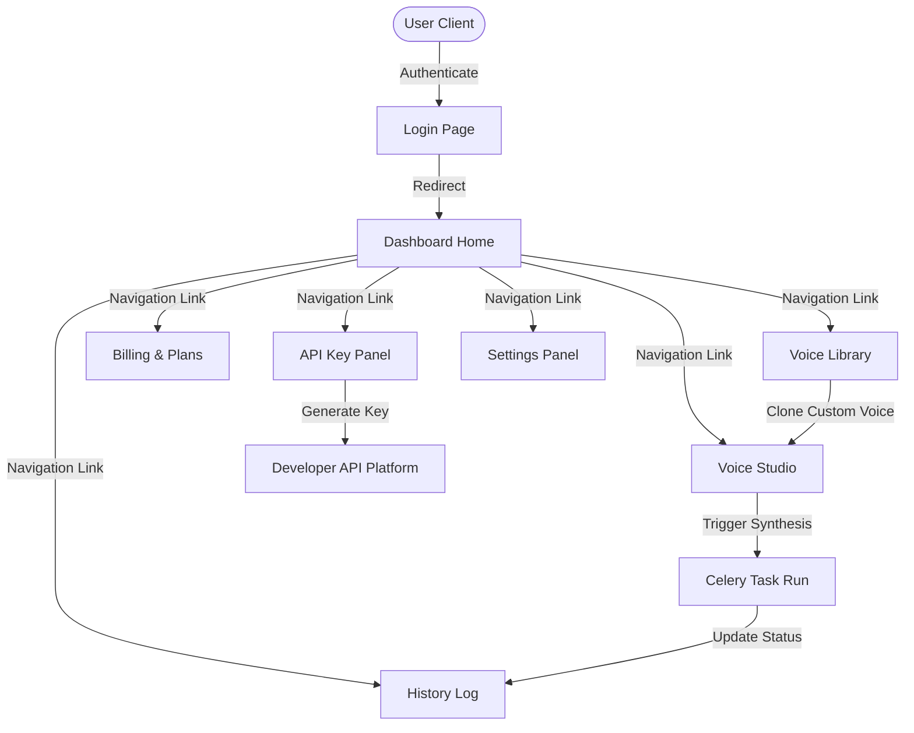

# ShivaAI Dashboard & User Experience Specification
**Module 4**  

---

## 1. UI Architecture & Design System

ShivaAI utilizes a modern React-based component hierarchy implementing a tokenized Design System.

### Design Tokens (CSS Custom Properties)
We utilize a tokenized palette designed for high contrast, modern aesthetics, and smooth transitions.

```css
:root {
  /* Color Palette - Indigo Deep Sea (Dark Mode Standard) */
  --bg-primary: #0a0c10;
  --bg-secondary: #121620;
  --bg-tertiary: #1b2030;
  
  --text-primary: #f3f4f6;
  --text-secondary: #9ca3af;
  --text-muted: #6b7280;

  --accent-blue: #3b82f6;
  --accent-purple: #8b5cf6;
  --accent-gradient: linear-gradient(135deg, var(--accent-blue), var(--accent-purple));
  
  --border-color: #242b3d;
  --success: #10b981;
  --warning: #f59e0b;
  --danger: #ef4444;

  /* Typography */
  --font-sans: 'Inter', system-ui, sans-serif;
  --font-mono: 'JetBrains Mono', monospace;

  /* Layout */
  --sidebar-width: 260px;
  --header-height: 70px;
  --radius-sm: 6px;
  --radius-md: 12px;
  --radius-lg: 18px;
}

[data-theme="light"] {
  /* Light Mode Equivalents */
  --bg-primary: #f9fafb;
  --bg-secondary: #ffffff;
  --bg-tertiary: #f3f4f6;
  
  --text-primary: #111827;
  --text-secondary: #4b5563;
  --text-muted: #9ca3af;

  --border-color: #e5e7eb;
}
```

---

## 2. Page & Component Hierarchy

The client application is split into nested layouts governed by the Next.js App Router.

```
/src/app
  ├── (auth)/                  # Layout: Centered Login/Register card
  │     ├── login/page.tsx
  │     └── signup/page.tsx
  └── (dashboard)/             # Layout: Persistent Sidebar + Header + Page Canvas
        ├── page.tsx           # Homepage (Overview & Quick Action)
        ├── studio/page.tsx    # Voice Studio (Text to Speech interface)
        ├── library/page.tsx   # Voice Library (Voice inventory and public search)
        ├── history/page.tsx   # Synthesis history table and audio player
        ├── keys/page.tsx      # API Key generation list
        ├── billing/page.tsx   # Subscription management & billing analytics
        └── settings/page.tsx  # User Profile & App configurations
```

### Shared Component Tree
To maintain maximum DRY (Don't Repeat Yourself) compliance:
* **`Sidebar`**: Left navigation container. Collapses to bottom sheet on mobile screens.
* **`AudioPlayer`**: Docked global playback tray that persists audio streaming across page navigation.
* **`UsageIndicator`**: Compact radial gauge widget tracking remaining character counts.
* **`MetricCard`**: Reusable dashboard card mapping statistic numbers with sparklines.

---

## 3. Navigation Flow

The user transitions between states through reactive dashboard routers:



---

## 4. Dashboard Page Wireframes

### Layout Outline
A responsive grid dividing screen space into layout sectors:

```
+-----------------------------------------------------------------------------------+
|  Logo   |  Search bar...                                   | Bell | User Profile  |
+---------+-------------------------------------------------------------------------+
| Sidebar | Main Page Content Canvas                                                |
| - Home  |                                                                         |
| - Studio|                                                                         |
| - Lib   |                                                                         |
| - Hist  |                                                                         |
| - Key   |                                                                         |
| - Bill  |                                                                         |
| - Set   |                                                                         |
+---------+-------------------------------------------------------------------------+
|                                  Persistent Audio Player tray                     |
+-----------------------------------------------------------------------------------+
```

### Dashboard Homepage Grid (Overview)
- **Top Row (Metrics)**: 
  * Total Characters Synthesized (Card + Linear graph)
  * Active Cloned Voices (Card)
  * Remaining Credits (Card + "Upgrade" call-to-action button)
- **Middle Left (Quick Synthesis)**:
  * Minimalist Text Box input area + Voice selector + "Generate" action button.
- **Middle Right (Recent Generations)**:
  * Table displaying the 5 most recent audio generation records, with play buttons and download actions.
- **Bottom Row (Usage Analytics)**:
  * Multi-line chart rendering character usage trended over the last 30 days.

---

## 5. Accessibility & UX Guidelines

ShivaAI enforces standard WCAG 2.1 AA design rules:
1. **Interactive Elements Focus**: Every clickable item must implement a `focus-visible` ring (`outline: 2px solid var(--accent-blue); outline-offset: 2px;`).
2. **Contrast Standards**: Typography contrast ratios must hold above `4.5:1` for regular text, and `3:1` for large header text.
3. **Screen Readers (ARIA)**: Semantic tags (`<nav>`, `<aside>`, `<main>`, `<header>`) are mandatory. Custom select elements (e.g. voice selectors) must set `role="listbox"` and track `aria-selected` attributes dynamically.
4. **Motion Controls**: Micro-animations must support media queries for motion reduction (`@media (prefers-reduced-motion: reduce)`).
