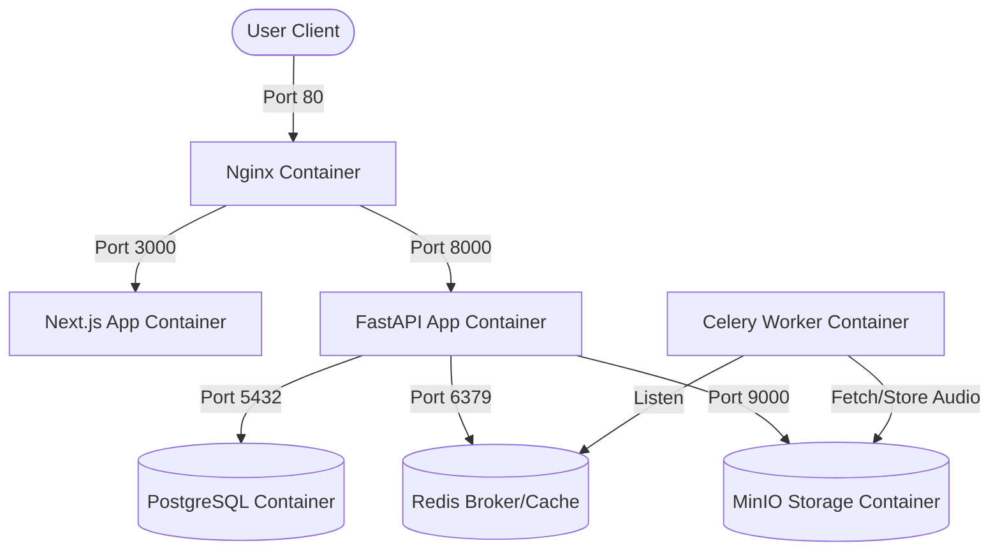
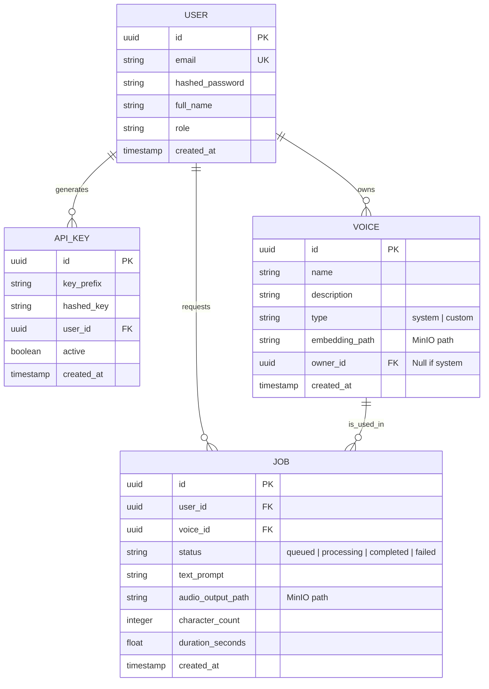

# ShivaAI (Svara AI) Foundation Project Architecture
**Module 1**  

---

## 1. System Folder Structure

ShivaAI utilizes a monorepo structure to keep services decoupled while allowing unified orchestration and shared configurations.

```
/svara-ai                      # Monorepo Workspace Root
  ├── docker-compose.yml         # Local docker orchestration
  ├── .env.example               # Reference environment variables template
  ├── ruff.toml                  # Shared python linting rules
  ├── .prettierrc                # Shared typescript/css formatting rules
  ├── run.ps1                    # Unified powershell script CLI
  ├── /nginx                     # Reverse proxy & gateway routing
  │     └── nginx.conf           # Gateway routing definitions
  ├── /backend                   # FastAPI service (API Gateway)
  │     ├── Dockerfile           # Backend builder rules
  │     ├── requirements.txt     # Python dependencies
  │     └── /app                 # Backend application directory
  ├── /worker                    # Celery ML worker service (TTS / Cloner)
  │     ├── Dockerfile           # Worker builder rules
  │     ├── requirements.txt     # Python dependencies
  │     └── /app                 # Worker application directory
  ├── /web                       # Next.js frontend (SaaS dashboard)
  │     ├── Dockerfile           # Web builder rules
  │     ├── package.json         # Web dependencies
  │     └── /src                 # Next.js App Router code
  └── /docs                      # System-wide documentation
        └── /architecture        # Architecture design specification files
```

---

## 2. Docker Architecture

Every service is fully containerized. Docker Compose governs the local development lifecycle, mirroring production Kubernetes workloads where possible.



All backend containers communicate inside a bridge overlay network named `svara-network`. Only Nginx (Port 80) and MinIO Web Console (Port 9001) expose ports to the host system.

---

## 3. Database Architecture (Entity Relationship Model)

We use **PostgreSQL** for user, voice metadata, and operational logging.



---

## 4. API Architecture

* **Control Plane (REST)**: Handles auth, profile, and voice management operations using standard JSON payloads over HTTP.
* **Data Plane (WebSockets)**: Handles real-time low-latency Text-to-Speech audio streaming, sending text frames and returning binary audio streams.
* **Authentication**: REST APIs are protected using standard **Bearer JWT** (JSON Web Tokens) or HTTP Header **X-API-KEY** authorization.

---

## 5. Coding Standards

### Python (Backend & Worker)
- **Formatter & Linter**: Strict enforcement of **Ruff** (consistent with Black formatting, line length: 88).
- **Type Annotations**: Mandatory type hinting for all functions, methods, and FastAPI models.
- **Async Programming**: Use `async`/`await` for I/O bound endpoints, and standard synchronous functions inside worker threads to prevent event-loop blockages.

### TypeScript / React (Web)
- **Formatter & Linter**: **Prettier** paired with **ESLint** (strict ruleset).
- **Type Safety**: Strictly no usage of `any`. Explicitly define prop interfaces and response types.

---

## 6. Git Workflow

To maintain a production-ready codebase, we follow a strict branching model:

```
[main]              # Production deployment (releases)
  ^
  | Pull Request (Automatic test runs)
[develop]           # Shared integration and staging testing
  ^
  | Branch & Merge
[feature/*]         # Individual feature branches
[bugfix/*]          # Active bugfixes
```

### Commit Guidelines
We use **Semantic Commits**:
- `feat: <description>`: A new feature
- `fix: <description>`: A bug fix
- `docs: <description>`: Documentation changes
- `refactor: <description>`: Code change that neither fixes a bug nor adds a feature
- `test: <description>`: Adding or correcting tests

---

## 7. System-wide Documentation Structure

Documentation is structured locally in a three-tier system:
1. **System Docs (`/docs`)**: Markdown files detailing high-level architecture designs, model pipelines, and system configuration runbooks.
2. **Inline Code Documentation**: Every public class, function, and model must include a docstring (Google Style for Python, and TSDoc for TypeScript).
3. **Interactive Developer Docs**: FastAPI automatically provisions `/docs` (Swagger UI) for developers to interact with and test APIs locally.
