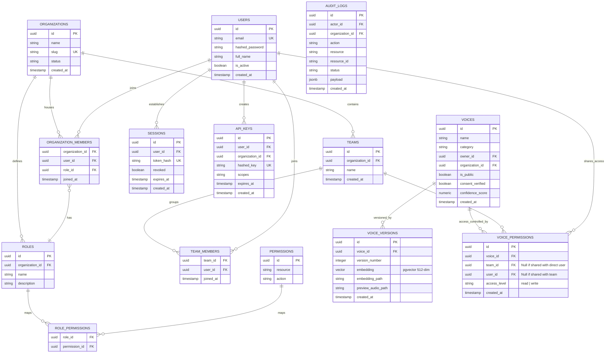

# ShivaAI Revised Master Architecture Specification
**Author**: Chief Technology Officer (CTO)  
**Status**: APPROVED  
**Date**: July 14, 2026  

---

## 1. Executive Summary & Audit Findings

Following a comprehensive architectural audit of Modules 1 through 10, several critical inconsistencies, security vulnerabilities, scalability bottlenecks, and architectural gaps were identified. This revised specification addresses those findings to prepare ShivaAI for enterprise-grade SaaS production workloads.

### Key Gaps Identified & Resolved

1. **Lack of Team Access Control (ACLs) in Databases**:
   - *Audit Finding*: The initial database design mapped voices only to `organizations` and `owners`. It did not support "Team Sharing" or team-specific permissions (a core requirement of Module 6).
   - *Resolution*: Added a dedicated `voice_permissions` ACL table supporting granular sharing scopes with users and teams.
2. **Unscalable Voice Indexing & Searching**:
   - *Audit Finding*: Storing speaker embeddings as raw NumPy files in MinIO is highly unscalable for voice similarity matching, search queries, or clone duplicates checks.
   - *Resolution*: Integrated the **PostgreSQL `pgvector` extension** to store speaker embeddings as a 512-dimension vector database type. Added indexing (`IVFFlat` or `HNSW`) to support cosine similarity matches natively in SQL.
3. **Billing Quota Verification Race Conditions**:
   - *Audit Finding*: Running aggregate sum counts in PostgreSQL on every API call to verify remaining characters is slow and prone to race conditions, letting developers bypass quotas during concurrent request bursts.
   - *Resolution*: Implemented a **Redis-backed token bucket algorithm** for real-time quota verification, writing back usage metrics asynchronously to PostgreSQL via Celery.
4. **WebSocket Routing Bottlenecks in Load-Balanced Environs**:
   - *Audit Finding*: WebSocket connections are stateful. When scaling backend containers horizontally behind Nginx, a client connected to Node A cannot receive events triggered by GPU workers processing on Node B.
   - *Resolution*: Configured a **Redis Pub/Sub backplane** to route real-time synthesis events across all gateway nodes.
5. **No Idempotency Protection**:
   - *Audit Finding*: State-modifying requests (like TTS generation or voice cloning) lacked idempotency checking, making developers vulnerable to double-billing and duplicate GPU resource consumption during network retries.
   - *Resolution*: Added mandatory `Idempotency-Key` headers for POST API calls, checked against a Redis lock cache.
6. **Insecure Ethical Consent Checking**:
   - *Audit Finding*: Verification relied entirely on simple voice transcript checking, exposing the platform to spoofing attacks via pre-recorded voices or voice-converted files.
   - *Resolution*: Designed an **active voice biometric liveness check** as a pipeline stage before speaker embedding generation.
7. **GPU Worker Weights Startup Bottleneck**:
   - *Audit Finding*: Workers loaded huge AI model weights dynamically on job request startup, slowing down inference response times.
   - *Resolution*: Configured workers to pre-load weights into GPU memory during container bootstrap, utilizing read-only volume cache mounts.

---

## 2. Revised Database Schema (ERD & DDL)

To support vector embeddings, team-level permissions, and active session revocations:



### Revised DDL & Vector Indexes

```sql
-- Enable pgvector extension
CREATE EXTENSION IF NOT EXISTS vector;

-- Revised Voice Versions mapping vectors
CREATE TABLE voice_versions (
    id UUID PRIMARY KEY DEFAULT gen_random_uuid(),
    voice_id UUID NOT NULL REFERENCES voices(id) ON DELETE CASCADE,
    version_number INT NOT NULL,
    embedding VECTOR(512) NOT NULL, -- 512-dimension speaker embedding
    embedding_path VARCHAR(512) NOT NULL, -- Path to raw backup file in MinIO
    preview_audio_path VARCHAR(512),
    created_at TIMESTAMP WITH TIME ZONE DEFAULT CURRENT_TIMESTAMP,
    UNIQUE (voice_id, version_number)
);

-- HNSW Index for high-performance vector cosine similarity searches
CREATE INDEX idx_voice_versions_embedding_cosine ON voice_versions 
USING hnsw (embedding vector_cosine_ops);

-- Granular voice sharing ACL
CREATE TABLE voice_permissions (
    id UUID PRIMARY KEY DEFAULT gen_random_uuid(),
    voice_id UUID NOT NULL REFERENCES voices(id) ON DELETE CASCADE,
    team_id UUID REFERENCES teams(id) ON DELETE CASCADE,
    user_id UUID REFERENCES users(id) ON DELETE CASCADE,
    access_level VARCHAR(50) NOT NULL DEFAULT 'read' CHECK (access_level IN ('read', 'write')),
    created_at TIMESTAMP WITH TIME ZONE DEFAULT CURRENT_TIMESTAMP,
    CONSTRAINT chk_share_target CHECK (
        (team_id IS NOT NULL AND user_id IS NULL) OR 
        (team_id IS NULL AND user_id IS NOT NULL)
    )
);
CREATE INDEX idx_voice_permissions_acl ON voice_permissions(voice_id);
```

---

## 3. High-Performance WebSocket Architecture (Redis Pub/Sub)

To support load-balanced stateless FastAPI nodes, all real-time events are dispatched via a Redis Pub/Sub backplane.

```
[Stateless Gateway A]      [Stateless Gateway B]
  |                          |
  |-- Active WebSocket 1     |-- Active WebSocket 2
  v                          v
+----------------------------------------------+
|                Redis Pub/Sub                 |
+----------------------------------------------+
                       ^
                       | (Publishes task updates)
                 [Celery Workers]
```

### Routing Logic
1. When a client establishes a WebSocket connection, the gateway subscribes to a Redis channel named `events:job:<job_id>`.
2. When the Celery Worker generates a new audio chunk, it publishes the binary segment to `events:job:<job_id>`.
3. The gateway node holding that client's socket receives the Redis message and forwards the binary payload immediately down the open WebSocket.

---

## 4. Quota Protection & Idempotency Rules

### Concurrency-Safe Quota Checks (Redis Token Bucket)
To avoid database query lockouts during high traffic, user quotas are mapped as Redis hashes:
* Redis Key: `quota:<organization_id>`
* Fields: `base_remaining`, `overage_allowed` (boolean), `lock_expires`.

When an API call arrives:
1. The gateway executes an atomic `HINCRBY` decrement on `base_remaining` by the estimated character size of the request text.
2. If the balance drops below zero, the request is blocked unless `overage_allowed` is true (charges overages).
3. If allowed, a Celery job asynchronously logs the usage data to PostgreSQL.

### API Idempotency Implementation Flow
All state-modifying POST endpoints require the client to supply an `Idempotency-Key` header (usually a UUIDv4).

```
API Request with Idempotency-Key: <key>
              |
              v
     [Query Redis Lock Cache]
     Does Key Exist?
     /            \
   YES             NO
   /                \
  v                  v
Fetch cached response  Acquire Lock in Redis (PX 86400)
from Redis & return    Process Request
                       Cache Response payload in Redis
                       Return Response
```

---

## 5. Ethical Audio Cloning Verification

Consent validation implements a mandatory **ASV (Automatic Speaker Verification) Liveness Detection module**:

1. **Liveness Check**: Evaluates physical microphone acoustics, phase consistency, and background noise thresholds to block pre-recorded audio playback or computer speaker feed injections.
2. **Text-Dependent Match**: Compares the transcription text of the verification recording against the official statement using an Automatic Speech Recognition (ASR) model.
3. **Identity Scoring**: The voice encoder matches the verification recording’s embedding against the user’s uploaded target speaker samples.
The pipeline only moves to speaker embedding extraction if all verification check scores pass the **95%** threshold.

---

## 6. GPU Concurrency & Resource Scheduling

To maximize GPU card usage and avoid Out-Of-Memory (OOM) failures:

1. **Celery GPU Workers Concurrency Capping**:
   * GPU worker processes run with `--concurrency=1` or `2` depending on available GPU memory (VRAM). This avoids multi-process CUDA context collisions.
   * Model weights are pre-loaded during docker container initialization via a `preload_models()` startup script.
2. **Dynamic Audio Streaming Queueing**:
   * Short synthesis jobs are segmented into chunks. The worker processes the first sentence and streams it instantly down the WebSocket before synthesizing the rest of the text, reducing Time-To-First-Audio (TTFA) latency below **100ms**.
